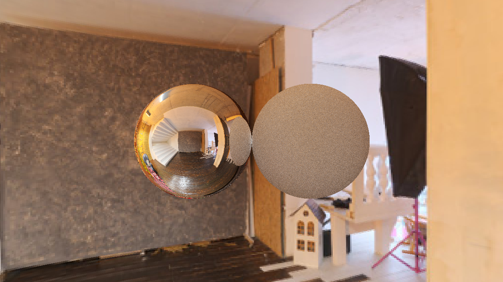
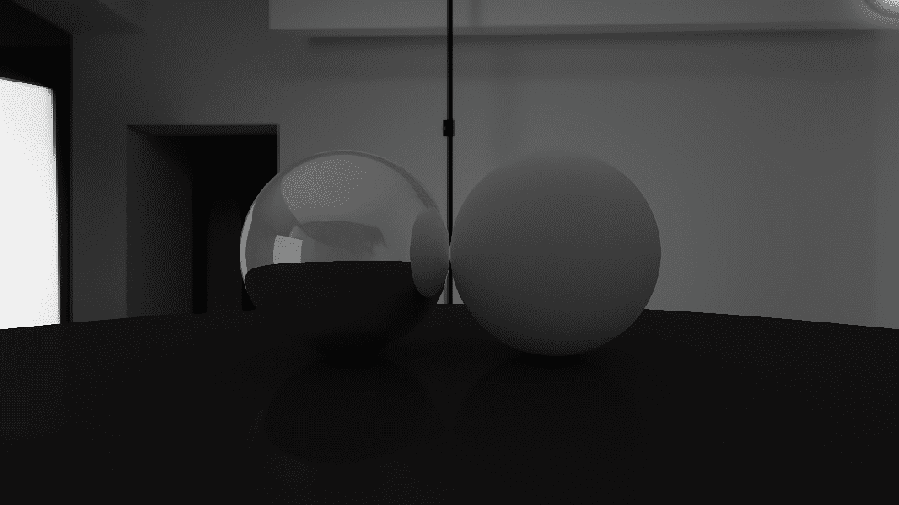
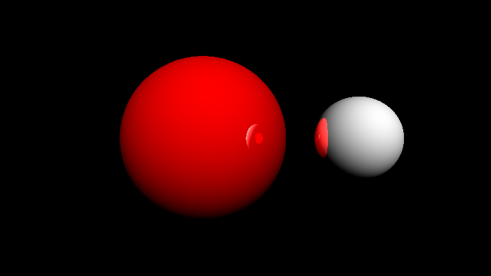

# Ray Tracer (CPU)
A basic CPU based Ray Tracer written in Python3.12 

## Installation

Simply download or clone this Repo, all you need is 3 packages.

1. Pillow (PIL fork) provides fast access to pixel data for the sky texture. To install it, run the following.
   ```
   pip install pillow
   ```
2. Pygame is a cross-platform set of Python modules designed for writing video games. Here it is used to display the render in real time.
   ```
   pip install pygame
   ```

4. Numpy is a package that helps with mathematical functions. To install it, run the following.
   ```
   pip install numpy
   ```
* NOTE: If you want to save a render, you will need an empty folder named `renders` in the same folder as the .py file.

## Usage

The program includes 2 txt files `config.txt` and `objects.txt`, which provides complete artistic controll over the final image without having to update the code.

### Config.txt
The file includes different settings related to the rendering process, like the number of `Samples`, the `Resolution`,and the number of light `bounces` per pixel.

Here is a list of all the Variables and what they do:

  1. `Size` decides the size(in pixels) of the render in y-axis/height of the window.
  2. `Resolution` decides the size of each rendered pixel, lower values give a crispier image.
     > Best results at Resolution=1.
       
  3. `Bounces` decides the max number of light bounces possible per pixel.
  4. `Samples` make the image clean by increasing the number of emmitted light rays per pixel.
  5. `Scanline` is a feature that lets you see th rendering process in real time.
  6. `Save` allows you to save every rendered frame in a sub-folder named `renders`.
  7. `Save_Format` lets you decide the output format of the rendered image.
  8. `Progressive_Resolustion` is a feature that lets you percieve the image getting crispier in real time.

### Objects.txt
The file is a list of objects(spheres) for the program to render. The format of this file is as follows:

`(-1,0,5)=1=(250,250,250)=glossy=0`

`Position=Radius=Color=glossy=Glossy_value`
   * Each field is seperated by an equals sign (=).
   * The First element is the Position in XZY coordinate system.
   * The Second element is the radius of the sphere.
   * The Third one is it's color in RGB format.
     > ranging from (0,0,0) to (255,255,255)
   * The Fifth one is the gloss value of the sphere.
     > ranging from 0 to 1
   * The Fourth one is just the text "glossy", leave it as is.


# Some Example Renders



